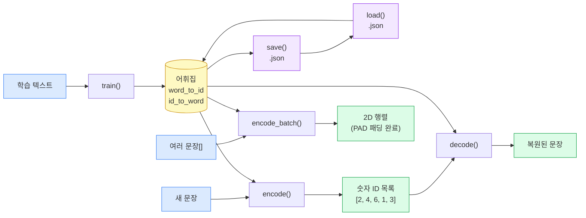
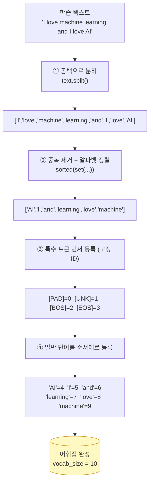
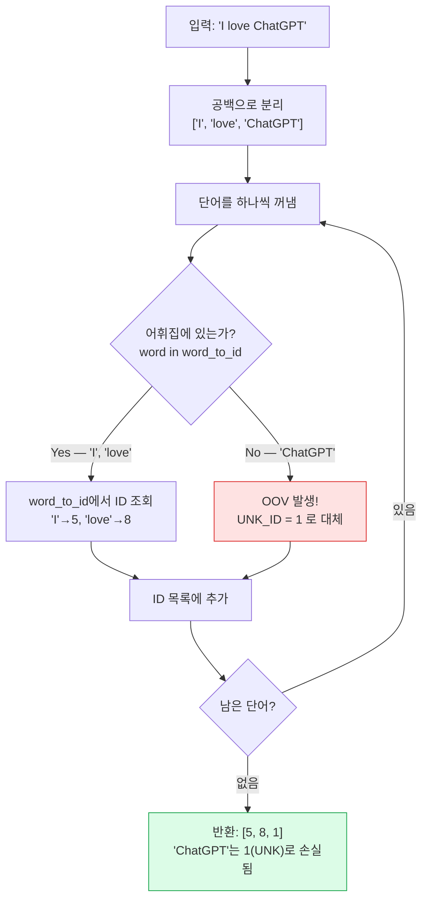
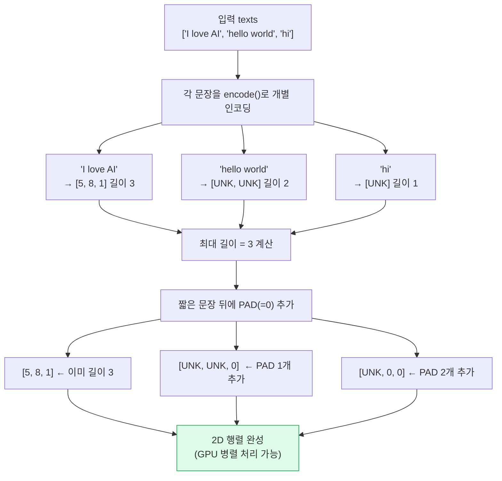
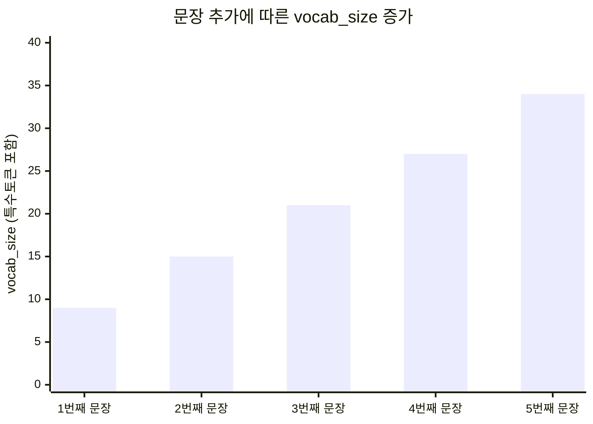
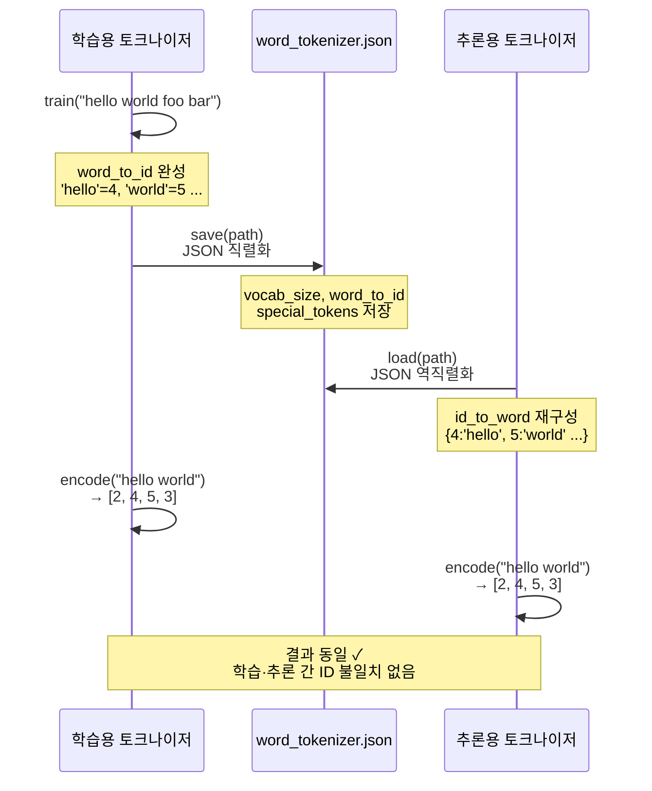

# 02. 단어 단위 토크나이저

## 목표

이 문서를 읽고 나면 다음 질문에 답할 수 있게 됩니다.

- 단어 단위 토크나이저는 어떻게 작동하는가?
- OOV(Out Of Vocabulary) 문제가 정확히 무엇인가?
- 왜 vocab_size가 폭발적으로 커지는가?
- 이 한계가 왜 BPE의 탄생으로 이어졌는가?

---

## 1. 단어 단위 토크나이저란?

글자 단위 토크나이저는 "hello"를 ['h', 'e', 'l', 'l', 'o'] 다섯 조각으로 쪼갰습니다.

단어 단위 토크나이저는 "I love AI"를 ['I', 'love', 'AI'] 세 조각으로 쪼갭니다.

**공백(스페이스)을 기준으로 문장을 분리**하는 것이 핵심입니다.

```
"I love natural language processing"
         ↓  공백으로 분리
['I', 'love', 'natural', 'language', 'processing']
         ↓  각 단어에 ID 부여
[4,    5,     6,         7,          8]
```

---

## 2. 어휘집(Vocabulary) 구축 과정

단어 단위 토크나이저의 학습(train) 과정을 단계별로 살펴봅시다.

### 학습 단계

```
학습 텍스트: "I love machine learning and I love AI"

1단계 — 공백으로 분리:
  ['I', 'love', 'machine', 'learning', 'and', 'I', 'love', 'AI']

2단계 — 중복 제거 후 정렬:
  ['AI', 'I', 'and', 'learning', 'love', 'machine']

3단계 — 특수 토큰 먼저, 그 다음 단어 순으로 ID 부여:
  [PAD]     → 0
  [UNK]     → 1
  [BOS]     → 2
  [EOS]     → 3
  'AI'      → 4
  'I'       → 5
  'and'     → 6
  'learning'→ 7
  'love'    → 8
  'machine' → 9

어휘집 크기(vocab_size) = 10
```

### 인코딩 단계

```
입력: "I love machine"

'I'       → 5
'love'    → 8
'machine' → 9

결과: [5, 8, 9]
```

글자 단위라면 "I love machine"이 14개 토큰이었을 것입니다.
단어 단위는 3개 토큰만으로 표현됩니다. **훨씬 효율적**입니다.

---

## 3. OOV 문제 — 단어 단위 토크나이저의 치명적 약점

### OOV란 무엇인가?

OOV는 **Out Of Vocabulary**의 약자입니다. 직역하면 "어휘집 밖"이라는 뜻입니다.

학습할 때 보지 못한 단어가 인코딩 시 등장하는 상황을 말합니다.

### 실제 예시로 이해하기

2010년도 뉴스 기사로 모델을 학습했다고 가정해 봅시다.

```
학습 데이터 (2010년 기사):
  "The president signed the legislation today."
  "Scientists discovered a new species in the Amazon."
  "The stock market rose sharply this morning."

→ 어휘집에는 이 문장들의 단어만 등록됩니다.
```

이제 2023년에 이 모델에 새 문장을 입력합니다.

```
입력 문장:
  "ChatGPT is transforming the way people use AI"

처리 결과:
  'ChatGPT'      → [UNK]  ← 2022년에 등장한 단어. 어휘집에 없음!
  'is'           → [UNK]  ← 학습 데이터에 없었음
  'transforming' → [UNK]  ← 'transform'은 있어도 '-ing' 형태가 없을 수 있음
  'the'          → 정상
  'way'          → 정상
  'people'       → 정상
  'use'          → 정상
  'AI'           → [UNK]  ← 대문자 형태가 없을 수 있음

결과: [[UNK], [UNK], [UNK], the, way, people, use, [UNK]]
```

문장의 핵심 의미를 담은 단어들이 모두 [UNK]가 되어버렸습니다.

### 시각적으로 보는 OOV

```
학습 어휘집 (원) 안에 있는 단어들:
┌─────────────────────────────────────┐
│  the  president  signed  legislation│
│  scientists  discovered  species    │
│  stock  market  rose  sharply  ...  │
└─────────────────────────────────────┘

새 문장의 단어들:

  ChatGPT  ←── 원 밖! → [UNK]
  transforming  ←── 원 밖! → [UNK]
  the  ←── 원 안! → 정상 처리
  AI  ←── 원 밖! → [UNK]
```

원 안에 있으면 정상 처리, 원 밖이면 무조건 [UNK]입니다.

### OOV 문제가 심각한 이유

[UNK]로 대체된 단어는 **의미가 완전히 사라집니다**.

```
원래 문장:  "ChatGPT is amazing technology"
처리 결과:  "[UNK] is amazing technology"

→ 무엇이 amazing technology인지 모델이 알 수 없습니다.
→ 디코딩해도 "[UNK] is amazing technology"가 나옵니다.
→ 원래 단어가 무엇이었는지 복원이 불가능합니다.
```

---

## 4. vocab_size 폭발 문제

### 영어 단어 수의 현실

단어 단위 토크나이저의 어휘집에는 모든 단어가 들어가야 합니다.

```
영어 단어 수:
  옥스포드 사전 기준:  약 170,000개 (현재 사용 단어)
  역사적 용례 포함:   약 600,000개
  기술 전문 용어:     수십만 개 추가
  신조어 (매년):      수천 개 추가

합리적인 영어 vocab_size: 최소 50,000 ~ 100,000개 이상
```

### 한국어는 더 심각하다

한국어는 **교착어(Agglutinative Language)** 입니다.
하나의 어근에 다양한 어미/조사/접사가 붙어 새로운 형태를 만듭니다.

```
'먹다'라는 동사 하나에서 파생되는 형태들:
  먹다, 먹고, 먹어, 먹으니, 먹으면, 먹어서, 먹었다,
  먹었고, 먹었으니, 먹겠다, 먹겠고, 먹어야, 먹어도,
  먹지, 먹지만, 먹더라도, 먹을, 먹는, 먹은, 먹힌다...

동사 하나에서만 수십 가지 형태 발생!
```

```
한국어 어휘집 크기 현실:
  기본 형태소:           약 200,000개
  활용형 포함:           수백만 개 이상
  전체를 커버하려면:     사실상 불가능
```

### vocab_size가 크면 어떤 문제가 생기는가?

AI 모델 내부에는 **임베딩 행렬(Embedding Matrix)** 이 있습니다.
이것은 각 단어 ID를 수백 차원의 숫자 벡터로 변환하는 거대한 표입니다.

```
임베딩 행렬 크기 = vocab_size × embedding_dim

예시 계산:
  vocab_size = 100,000 (영어 단어 단위)
  embedding_dim = 768 (GPT-2 기준)

  → 행렬 크기 = 100,000 × 768 = 76,800,000개 숫자
  → 메모리: 약 300MB (float32 기준)

  한국어 포함하면:
  vocab_size = 1,000,000 (백만)
  → 행렬 크기 = 약 7억 6천만 개 숫자
  → 메모리: 약 3GB — 이것만으로도 엄청난 용량!
```

vocab_size가 2배 커지면 임베딩 행렬도 2배 커집니다.
이것이 **vocab_size 폭발 문제**입니다.

---

## 5. 글자 단위 vs 단어 단위 비교표

| 비교 항목 | 글자 단위 (1단계) | 단어 단위 (2단계) |
|---|---|---|
| 쪼개는 기준 | 글자 하나하나 | 공백으로 구분된 단어 |
| "hello world" 토큰 수 | 10개 | 2개 |
| vocab_size (영어) | ~100개 | ~170,000개 |
| vocab_size (한국어 포함) | ~10,000개 | 수백만 개 |
| OOV 문제 | 거의 없음 | 심각함 |
| 시퀀스 길이 | 매우 김 | 짧음 |
| 의미 단위 처리 | 불가 | 가능 |
| 실무 사용 여부 | 거의 없음 | 거의 없음 |

두 방식 모두 실무에서 잘 사용하지 않습니다. 각자 치명적인 단점이 있기 때문입니다.

---

## 6. 두 방식의 한계를 동시에 해결하는 방법은?

글자 단위와 단어 단위의 문제를 정리하면 이렇습니다.

```
글자 단위의 문제:
  ✗ 시퀀스가 너무 길어짐 (처리 속도 저하)
  ✗ 의미 단위를 잃어버림

단어 단위의 문제:
  ✗ vocab_size 폭발 (메모리 부족)
  ✗ OOV 문제 (새 단어 처리 불가)

우리가 원하는 이상적인 토크나이저:
  ✓ 시퀀스가 적당히 짧음
  ✓ 어느 정도 의미 단위를 유지
  ✓ vocab_size가 관리 가능한 크기 (~50,000)
  ✓ OOV 문제 없음
```

이 네 가지를 동시에 달성한 방법이 바로 **BPE(Byte Pair Encoding)** 입니다.

BPE는 다음 아이디어에서 출발합니다.

> "처음에는 모든 것을 글자(또는 바이트) 단위로 쪼갠다.
>  그런 다음, 자주 붙어 나오는 조각들을 하나로 합친다.
>  이것을 반복하면, 자연스럽게 자주 나오는 단어나 접두사, 접미사가 하나의 토큰이 된다."

---

---

## 도표로 보는 WordTokenizer

### 다이어그램 1 — 전체 데이터 흐름

메서드 간 데이터가 어떻게 이동하는지 한눈에 봅니다.



---

### 다이어그램 2 — `train()` 내부 과정

학습 텍스트가 어휘집으로 변환되는 4단계를 따라갑니다.



---

### 다이어그램 3 — `encode()` OOV 분기

단어 하나하나를 처리할 때 어떤 판단이 일어나는지 봅니다.



---

### 다이어그램 4 — `encode_batch()` + PAD 패딩

길이가 다른 여러 문장을 같은 크기의 행렬로 만드는 과정입니다.



---

### 다이어그램 5 — vocab_size 폭발

문장이 추가될수록 어휘집이 선형으로 커지는 흐름입니다.



> 고작 5문장만 추가해도 어휘집이 4 → 34로 증가합니다.  
> 위키피디아 전체(약 60억 단어)로 학습하면 수백만 개로 폭발합니다.

---

### 다이어그램 6 — `save()` / `load()` 흐름

어휘집을 JSON으로 저장하고 불러와도 인코딩 결과가 동일해야 합니다.



---

## 정리

| 개념 | 설명 |
|---|---|
| 단어 단위 토크나이저 | 공백 기준으로 단어를 쪼개고 ID를 부여하는 방식 |
| OOV(Out Of Vocabulary) | 학습 데이터에 없는 단어가 [UNK]로 대체되는 문제 |
| vocab_size 폭발 | 언어 전체의 단어 수가 너무 많아 어휘집이 거대해지는 문제 |
| 임베딩 행렬 | vocab_size × embedding_dim 크기의 변환 표, vocab_size에 비례해 커짐 |
| 교착어 | 한국어처럼 어근에 다양한 어미가 붙어 새 형태를 만드는 언어 |

---

## 다음 단계 — BPE 토크나이저

단어 단위 토크나이저의 두 가지 한계(OOV 문제, vocab_size 폭발)를 이해했습니다.

다음에는 이 두 문제를 동시에 해결하는 **BPE(Byte Pair Encoding)** 알고리즘을 배웁니다.

BPE의 핵심 아이디어는 단순합니다.

```
"자주 붙어 나오는 것은 하나로 묶자."
```

글자 단위에서 시작해서, 자주 나오는 조합을 반복해서 합치면
자연스럽게 의미 있는 단위(단어, 접두사, 접미사)가 형성됩니다.

다음 문서: `03_bpe_algorithm.md`
다음 코드: `basic_tokenizer.py`
